# 💰 Project Cost Analysis

This document outlines the projected and actual costs associated with building, running, and maintaining the **Claude Developer Certification Study Mastery App**.

---

## 📊 Cost Summary Table

| Category | Cost Item | Pricing Model | Estimated Cost (One-time) | Operating Cost (Monthly) |
| :--- | :--- | :--- | :--- | :--- |
| **LLM & GenAI API** | Mnemonic & Question Text Gen | Claude 3.5 / Gemini Pro | ~$15.00 | $0.00 |
| **LLM & GenAI API** | Surreal Memory Palace Images | Imagen / DALL-E 3 | ~$5.00 | $0.00 |
| **LLM & GenAI API** | Text-to-Speech (TTS) Audio | Azure Speech / OpenAI TTS | ~$6.00 | $0.00 |
| **Hosting & Cloud** | Frontend Hosting (GitHub Pages) | Free static pages hosting | $0.00 | $0.00 |
| **Hosting & Cloud** | Backend API (Azure Function App)| Consumption Tier | $0.00 | ~$0.00 (under free grant) |
| **Hosting & Cloud** | Assets & Memory Cards Storage | Azure Blob Storage (LRS) | $0.00 | ~$0.50 |
| **AI Developer Tools** | Gemini CLI / Code | Monthly Subscription (Single-vibe tasks) | $0.00 | $20.00 |
| **AI Developer Tools** | Claude CLI / Code | Monthly Subscription (Bulk backlog execution) | $0.00 | $20.00 |
| **Development** | Engineering Time | Architecture, React UI, API | ~70 Hours ($0 - Internal) | $0.00 |
| **Total Financial Outlay**| | | **~$26.00** | **~$40.50** |

---

## 🤖 GenAI API Costs Breakdown

### 1. Text & Mnemonic Generation (LLM)
* **API Used**: Claude 3.5 Sonnet & Gemini 1.5 Pro
* **Volume**: ~100 questions & memory cards + system architecture guidelines.
* **Token Estimate**: ~1.5 Million input/output tokens total across draft runs and final selections.
* **Calculation**: `1.5M tokens * average rate of $10/M tokens` = **~$15.00**

### 2. Surreal Memory Palace Images
* **API Used**: Midjourney / DALL-E 3 / Stable Diffusion
* **Volume**: ~100 custom illustration/palace images for visual mnemonics.
* **Calculation**: `100 images * $0.04 to $0.05 per image` = **~$5.00**

### 3. Audio & TTS (Kokoro Local vs. Cloud API)
* **Local Option**: Running `Kokoro TTS` locally using ONNX runtime. Cost is **$0.00** (compute only).
* **Cloud API Option**: Azure Speech Services / OpenAI TTS for production-grade audio streams.
* **Calculation**: `~300,000 characters * $15.00/M characters` = **~$4.50 - $6.00**

---

## ☁️ Azure & Infrastructure Costs Breakdown

> [!NOTE]
> All hosting strategies leverage standard free tiers to minimize persistent operating expenditure (OpEx) for student projects.

### 1. Azure Function App (Serverless)
* **Tier**: Consumption Plan
* **Included Free Grant**: 1 Million requests and 400,000 GB-seconds of compute resource per month.
* **Actual Usage**: Under 10,000 executions per month.
* **Cost**: **$0.00/month**

### 2. Azure Blob Storage
* **Tier**: Hot / Locally Redundant Storage (LRS)
* **Storage Size**: ~150MB of images, JSON data, and Markdown memory cards.
* **Cost**: **~$0.02 - $0.50/month** (highly dependent on retrieval operations, but easily falls under minimal transaction costs).

### 3. GitHub Pages
* **Cost**: **$0.00/month** (free hosting for public repositories).

---

## 💻 AI Development Tool Subscriptions

To maximize development velocity, dual agent-assisted workflows are utilized:
* **Gemini CLI (Google AI Studio / Advanced Subscription)**: **$20.00/month**
  * *Role*: Running single ad-hoc tasks, quick code edits, real-time validations, and exploratory "single-vibe" tasks.
* **Claude CLI / Code (Anthropic Pro Subscription / API / CLI Usage)**: **$20.00/month**
  * *Role*: Bulk backlog execution, multi-file code editing, and deep context architectural orchestration.

---

## ⏱️ Engineering & Development Time

Building a production-ready interactive site requires multi-disciplinary stages, broken down below:

```mermaid
gantt
    title Development Time Distribution (Total: ~70 Hours)
    dateFormat  X
    axisFormat %d
    section Backend & Infra
    Azure Functions & Storage Setup :active, 0, 10
    section Core Data
    Question Verification & Markdown docs : 10, 32
    section Frontend React
    UI Design, Theme & Cookie Persistence : 32, 52
    section Testing & CI
    JSDOM Testing & Validation Scripts : 52, 60
    section Polish
    Mermaid Diagram Integration & Audit : 60, 70
```

1. **Architecture & Cloud Integration (10 Hours)**
   * Setting up the 7-stage directory structure.
   * Creating the Azure Function App API and wiring Azure Blob Storage endpoints.
2. **Content Curation & Structuring (22 Hours)**
   * Developing 100 questions matching the 5 certification competencies.
   * Formatting individual questions, mnemonics, and concepts.
3. **Frontend Development (20 Hours)**
   * Creating a zero-build React Single-Page Application (`index.html`).
   * Implementing cookie-persistent trackers (mastered counts, Bloom's self-learning progress tracker).
   * Designing theme colors (vibrant dark theme tokens) and drawer layout menus.
4. **Testing, Linting, & Validation (8 Hours)**
   * Writing JSDOM unit tests in `7_Testing_Known/`.
   * Setting up static validation checks.
5. **Polishing & Auditing (10 Hours)**
   * Resolving duplication blocks, generating diagrams, and testing layout responsiveness.
