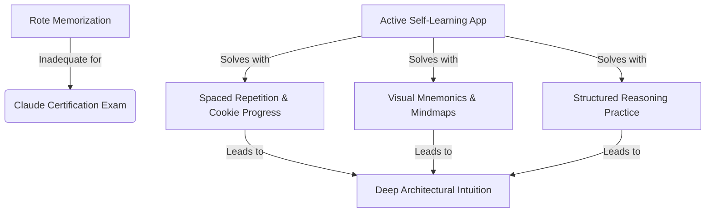

# 📌 Problem Statement

## The Core Challenge
Preparing for the **Claude Developer Certification** exam requires more than rote memorization. The exam assesses a developer's ability to design, build, and deploy agentic workflows, model context protocols (MCP), prompt pipelines, and reliable token-efficient loops. 

Traditional study resources (e.g., static PDFs, text dumps, simple flashcards) fall short in three major ways:
1. **Passive Learning vs. Active Synthesis:** Static text fails to engage developers in active recall or structured reasoning.
2. **Context Window & Cost Bloat:** Developers struggle to understand context-window limitations, token optimization, and system-prompt compression in a tangible, visual way.
3. **No Progressive Mastery Tracking:** There is no easy, serverless way to track cognitive progression across different taxonomy levels (Bloom's Taxonomy) without complex logins.

---

## The Solution: Active Self-Learning App
This project provides a serverless, single-file React-based **Study Mastery App** that addresses these pain points directly:

### Key Solution Pillars:
* **Active Recall:** 100 high-fidelity questions mapping to the 5 core exam competencies.
* **Spaced Repetition & Spaced Retrieval:** Leveraging browser cookies to track mastered items and dynamically surface weak areas without backend server dependencies.
* **Visual Mnemonics:** Each question includes detailed SVG/emoji memory aids to associate dry concepts with memorable objects.
* **Structured Learning Path:** Concept documents mapping directly to Bloom's learning stages (Remembering via flashcards -> Analysing via diagrams -> Creating via active tool building).
