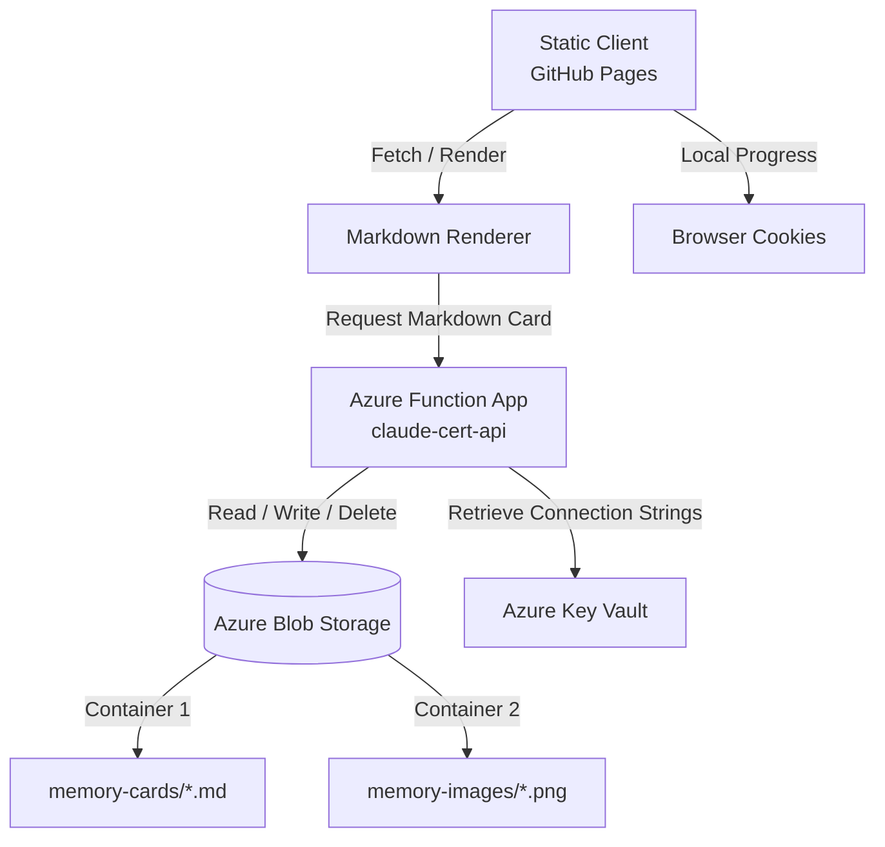

# ☁️ Azure Cloud Integration

This document outlines the **Azure Cloud Architecture** utilized by the study guide application. It explains how serverless functions, blob storage, and secrets management integrate with the static frontend to deliver a fast, zero-maintenance active self-learning app.

---

## 🏗️ Architecture Diagram

The application leverages a hybrid edge-serverless model where the static client queries Azure Functions dynamically to fetch, write, or delete memory cards, while maintaining user progress locally in browser cookies.

---

## 📦 Azure Services

### 1. Azure Blob Storage
All collaborative study data (memory cards, concept diagrams, visual aids) is stored in Azure Blob Storage. This enables dynamic updates without triggering full site rebuilds on GitHub.

| Container | Content | Access Control | Naming Convention |
|-----------|---------|----------------|-------------------|
| `memory-cards` | Detailed markdown flashcard study guides | Public Read / Authenticated Write | `MEM-Q{ID}.md` (e.g., `MEM-Q005.md`) |
| `memory-images` | Diagrams, sketches, visual mnemonics | Public Read / Authenticated Write | `MEM-Q{ID}_v{Version}.png` |

---

### 2. Azure Function App (`claude-cert-api`)
A serverless Node.js API that manages CRUD operations for files stored in Blob Storage.
* **Base URL:** `https://claude-cert-api.azurewebsites.net/api`

#### Key Endpoints:
1. **`Authenticate`** (`POST`)
   * *Purpose:* Validates developer keys and issues transient access states.
2. **`Cards`** (`GET`, `POST`, `DELETE`)
   * *GET:* Fetches the raw markdown contents of a specific card.
   * *POST:* Writes or updates a card's markdown in the `memory-cards` container.
   * *DELETE:* Removes a card from the container.
3. **`UploadImage`** (`POST`)
   * *Purpose:* Accepts multipart form data to upload visual mnemonics into the `memory-images` container.

---

### 3. Azure Key Vault
To ensure enterprise-grade security, no credentials (storage connection strings, admin keys) are committed to git.
* All secrets are configured as environment variables in the Azure Function App, mapped directly to **Azure Key Vault** secrets using System-Assigned Managed Identities.
* Key secrets stored:
  * `AzureWebJobsStorage` — Connection string for the storage account.
  * `AdminToken` — Developer authentication passphrase.

---

## 🚀 Key Architectural Benefits
1. **High Performance:** Standard questions are hardcoded in a lightweight client script, loading instantly. Heavy, text-dense memory cards load on-demand via asynchronous fetch.
2. **Zero Maintenance:** Serverless resources scale down to zero when idle, meaning zero runtime costs and high durability under study traffic spikes.
3. **Decoupled Updates:** Memory card additions do not require developer intervention or deployment actions on the repository; content edits propagate instantly through the Azure Function API.
