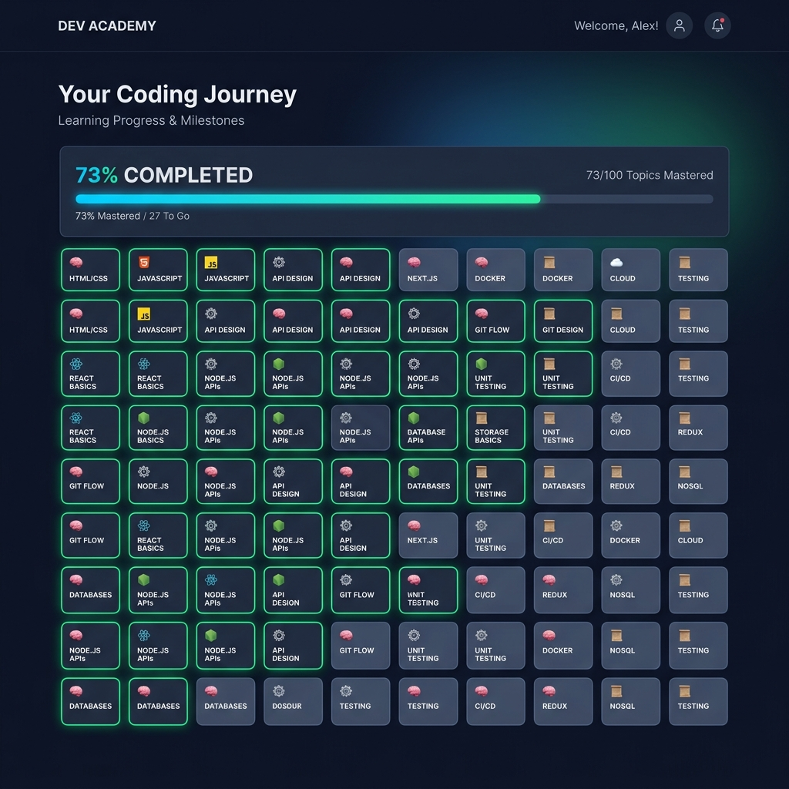
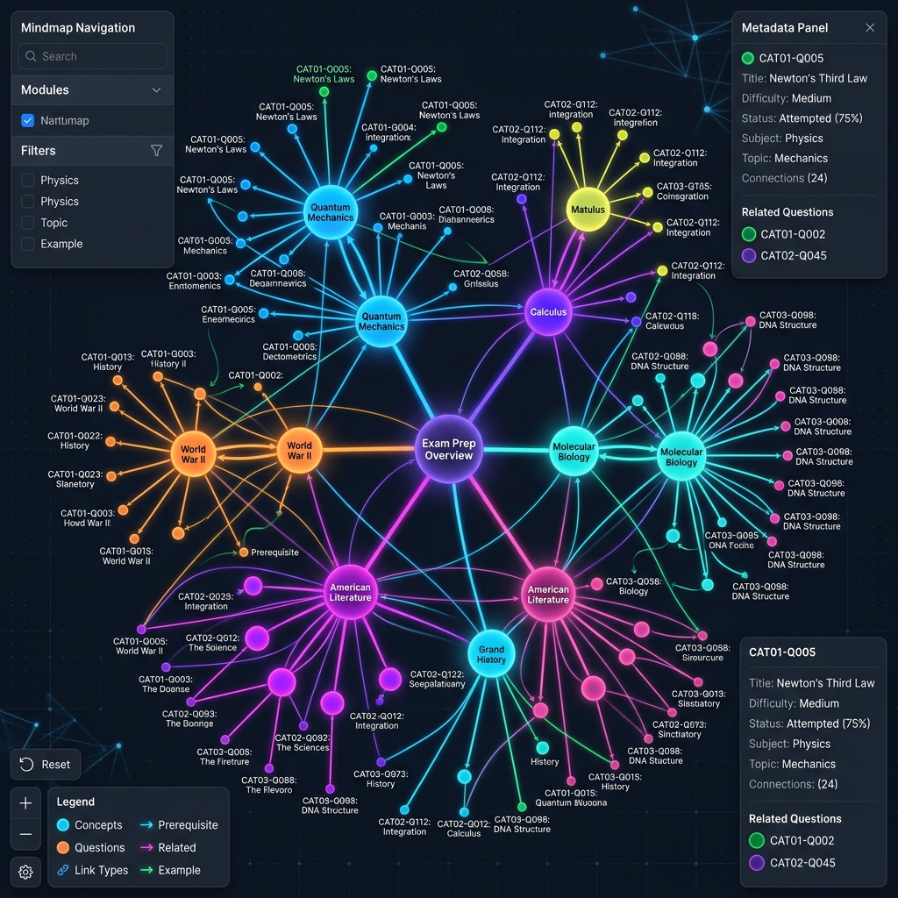
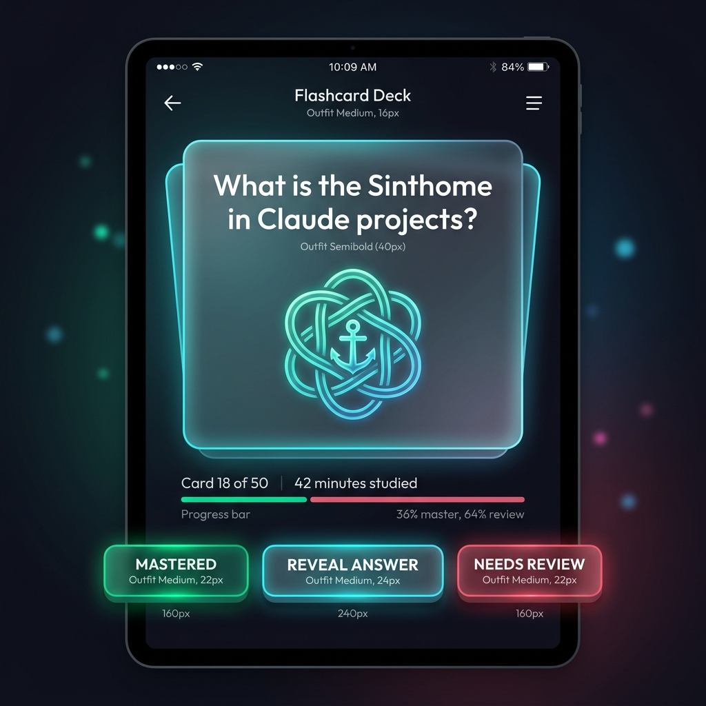

# 📱 User Experience & Journey Simulation

This document outlines the core user journey, interaction models, and learning theories that power the **Claude Developer Certification - Study Mastery App**. Below we break down the three primary views of the application to explain the **What**, **Why**, and **How** of using the site.

---

## 📊 1. Study Dashboard (The Active Recall Grid)

The Study Dashboard serves as the central hub of your certification preparation. It provides an instant visual index of the 100 questions aligned with the exam's core competencies.

### 🖼️ Simulation Mockup

### 🧐 The UX Breakdown
* **WHAT is it?**
  A dense, color-coded grid representing the 100 core questions mapped to 5 competencies. Each grid node is interactive and visually tracks your current mastery level (e.g., Unattempted, Weak, Hard, Mastered).
* **WHY is it designed this way?**
  Based on cognitive psychology, visualizing progress as a single cohesive dashboard prevents study overwhelm and reduces decision paralysis. By exposing progress transparently, it leverages the **Zeigarnik Effect** (the psychological tendency to remember uncompleted tasks better than completed ones), motivating users to fill in their knowledge gaps.
* **HOW do you use it?**
  1. **Identify Patterns:** Scan the dashboard for clusters of red (Weak) or yellow (Hard) blocks.
  2. **Filter & Focus:** Use the top filter buttons to isolate questions matching a specific competency (e.g., CAT01 for Agentic Architecture).
  3. **Launch Exercises:** Click any individual cell in the grid to drill directly into that specific memory card or active recall session.

---

## 🗺️ 2. Memory Palace Mindmap (Conceptual Relationships)

The Memory Palace Mindmap provides a high-level interactive semantic web, linking abstract technical concepts together to build systemic engineering intuition.

### 🖼️ Simulation Mockup

### 🧐 The UX Breakdown
* **WHAT is it?**
  An interactive, node-based graph visualization mapping out the relationships between different competencies, tools, and protocols—such as how Model Context Protocol (MCP) clients relate to server configurations, subagents, and context compression rules.
* **WHY is it designed this way?**
  Rote memorization fails for advanced system-engineering certifications. According to **Dual-Coding Theory**, combining verbal concepts with non-verbal visual structures creates separate, additive cognitive traces in your brain. This makes it easier to recall how changing prompt guidelines (CAT04) impacts token conservation and window constraints (CAT05).
* **HOW do you use it?**
  1. **Explore the Web:** Pan and zoom around the mindmap to trace links.
  2. **Inspect Relationships:** Hover over nodes to highlight connections and display a quick-summary modal explaining the dependency.
  3. **Deep Dive:** Double-click any concept node (e.g., "MCP Clients") to jump straight to the detailed markdown study guide in `4_Formula/concepts/`.

---

## 🧠 3. Flashcard Recall View (The Feedback Loop)

This view is the engine room of active learning, where you interact with study challenges, view visual mnemonics, and update your mastery scores.

### 🖼️ Simulation Mockup

### 🧐 The UX Breakdown
* **WHAT is it?**
  An interactive testing interface combining structured multiple-choice questions, SVG concept hints, emoji-driven memory mnemonics, and self-assessment buttons (Correct, Hard, Weak).
* **WHY is it designed this way?**
  **Active Recall** (retrieval practice) forces your brain to retrieve info, strengthening synaptic pathways. The self-assessment buttons trigger **Spaced Repetition System (SRS)** rules, saving your status in local cookies to ensure that hard questions recur frequently, while mastered cards are delayed to maximize long-term storage efficiency.
* **HOW do you use it?**
  1. **Evaluate:** Read the scenario and select your answer.
  2. **Strive & Assist:** If stuck, click **"Show Mnemonic Hint"** to view an SVG schema or emoji-based memory aid instead of immediately looking at the answer.
  3. **Grade Your Recall:** Submit your answer, read the detailed explanation, and choose:
     * 🔴 **Weak:** Adds the question to immediate review queues.
     * 🟡 **Hard:** Review soon.
     * 🟢 **Correct:** Review at longer intervals.
