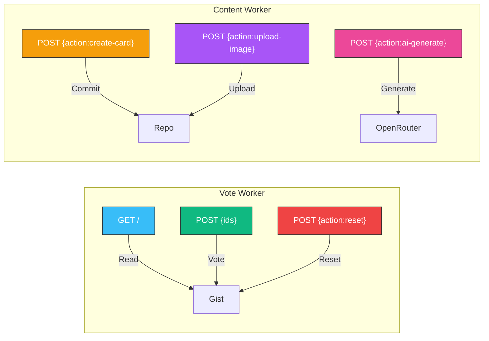

# Deployment Documentation

All deployment guides for the Claude Certification Study App infrastructure.

## Guides

| Document | Description |
|----------|-------------|
| [Cloudflare Worker](cloudflare-worker.md) | Deploy vote + content workers |

## Two Workers

## Quick Links

| Resource | URL |
|----------|-----|
| Cloudflare Dashboard | https://dash.cloudflare.com/3683d1886e0a3a3152242c84f226ba3f/workers-and-pages |
| Vote Worker | https://vote-worker.polished-boat-17b2.workers.dev |
| Content Worker | https://content-worker.polished-boat-17b2.workers.dev |
| GitHub Gist (votes) | https://gist.github.com/rifaterdemsahin/2bfb092b05e08669b092f8371ac9c018 |
| GitHub Repo | https://github.com/rifaterdemsahin/claude_certification_exam |
| GitHub Pages | https://rifaterdemsahin.github.io/claude_certification_exam |
| OpenRouter Keys | https://openrouter.ai/keys |
| GitHub Tokens | https://github.com/settings/tokens |

## Worker Files

| File | Purpose |
|------|---------|
| `scripts/vote-worker.js` | Vote read/write/reset |
| `scripts/content-worker.js` | Cards, images, AI writing |
| `tests/test_vote_worker.js` | Vote worker tests |
| `tests/test_content_worker.js` | Content worker tests |

## Prerequisites

- GitHub Classic Token with `repo` + `gist` scopes
- OpenRouter API Key (for AI writing helper)
- Cloudflare free tier account
