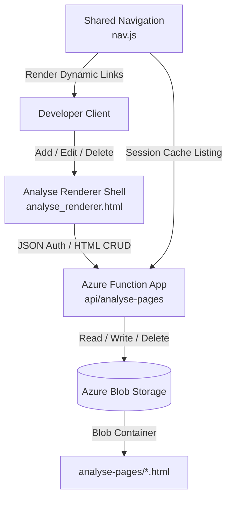

# 🌐 Dynamic Analysis Pages Architecture (Azure)

This formula documents the system design and steps used to move the analysis HTML pages (e.g., `context_compression.html`, `explicit_criteria.html`, `structured_reasoning.html`, `multi_turn.html`, `agi-path.html`, and `skills.html`) to Azure. This allows the author to dynamically add, edit, and delete analysis pages from a web UI without needing a git commit or site redeployment.

---

## 🏗️ Architecture Design

The dynamic analysis pages leverage the same serverless and blob storage architecture already utilized for memory cards:



### Components

1. **Azure Blob Storage Container (`analyse-pages`):** Holds the raw HTML files representing study analyses. Content-Type is stored as `text/html`.
2. **Azure Function Endpoint (`/api/analyse-pages`):**
   - `GET /api/analyse-pages` (List all blobs in the container).
   - `GET /api/analyse-pages?filename=xxx.html` (Download the raw HTML string of a page).
   - `POST /api/analyse-pages` (Write/update the content of a page; requires token validation).
   - `DELETE /api/analyse-pages?filename=xxx.html` (Delete a page; requires token validation).
3. **Analyse Renderer Shell (`analyse_renderer.html`):** A shell page that accepts a `?page=name.html` parameter, loads the page from Azure, and embeds it cleanly within the main application style and navigation context. It also includes the edit, create, and delete UI.
4. **Stats Hub Integration (`analyse.html`):** Lists all dynamic analysis pages retrieved from Azure and provides a link to create new pages.
5. **Redirect Stubs:** Standard HTML pages are replaced with lightweight stubs that automatically redirect visitors to the dynamic renderer shell.

---

## 🛠️ Step-by-Step Implementation

### Step 1: Azure Function Configuration

Created the Azure Function endpoint configuration at `5_Symbols/azure-api/AnalysePages/function.json`:
- **Route:** `analyse-pages`
- **Methods:** `GET`, `POST`, `DELETE`, `OPTIONS`
- **Auth Level:** `anonymous` (CORS and explicit bearer tokens handle auth)

Created the function logic at `5_Symbols/azure-api/AnalysePages/index.js`:
- Uses `@azure/storage-blob` SDK.
- Connects using `process.env.AzureWebJobsStorage`.
- Ensures the `analyse-pages` container exists.
- Performs Bearer token validation for write/delete requests using the in-memory shared admin state.

#### CORS Preflight Infrastructure Config:
To ensure that the Azure platform does not block preflight `OPTIONS` requests (which results in browser CORS blocks, particularly if the endpoint is not deployed yet and returns a 404), allow wildcard origins (`*`) at the Azure Portal/infrastructure level:
```bash
az functionapp cors add --name "claude-cert-api" --resource-group "claude-certificate-training" --allowed-origins "*"
```

### Step 2: Analysis Page Renderer & Editor

Created `5_Symbols/pages/analyse_renderer.html` which acts as:
- A viewer: extracts styling and body content from fetched dynamic HTML and renders them in the shell.
- An editor: displays a code editor for HTML markup.
- A creator: pre-populates a standard template to quickly spin up new analysis pages.

### Step 3: Stats Hub Update

Modified `5_Symbols/pages/analyse.html` to query the list of files from `/api/analyse-pages` and dynamically construct links to `analyse_renderer.html?page=xxx.html`.

### Step 4: Migration & Redirect Pattern

To keep bookmarks and direct links alive while moving analysis files to Azure, replace the local HTML files (e.g. `5_Symbols/pages/context_compression.html`) with redirect stubs:

```html
<!DOCTYPE html>
<html>
<head>
    <meta http-equiv="refresh" content="0; url=analyse_renderer.html?page=context_compression.html">
    <script>
        window.location.href = "analyse_renderer.html?page=" + window.location.pathname.split('/').pop();
    </script>
</head>
<body>
    Redirecting to the dynamic analysis page...
</body>
</html>
```

---

## 🧪 Verification & Testing

Created `7_Testing_Known/test_analyse_pages.js` to assert functionality:

1. **Public Capabilities:** Verifies that GET lists files and OPTIONS returns valid CORS headers.
2. **Access Control:** Verifies that POST/DELETE requests without a bearer token fail with `401 Unauthorized`.
3. **E2E CRUD Flow:** If run with `ADMIN_PASSWORD` configured, it authenticates with `/api/auth`, creates a test file, retrieves it, edits the content, retrieves it again, deletes it, and asserts a 404.

### Running the tests

```bash
# Run structural/read tests
node 7_Testing_Known/test_analyse_pages.js

# Run full CRUD tests
ADMIN_PASSWORD=your_admin_password node 7_Testing_Known/test_analyse_pages.js
```

---

## 🚀 Deployment Instructions

1. **Deploy the Function App code:**
   ```bash
   cd 5_Symbols/azure-api
   npm install
   npx func azure functionapp publish claude-cert-api --build remote
   ```
2. **Upload existing pages:**
   Use the edit portal or Azure Storage Explorer to upload existing HTML files to the `analyse-pages` container.
3. **Configure allowed CORS origins on Azure:**
   ```bash
   az functionapp cors add --name "claude-cert-api" --resource-group "claude-certificate-training" --allowed-origins "*"
   ```
