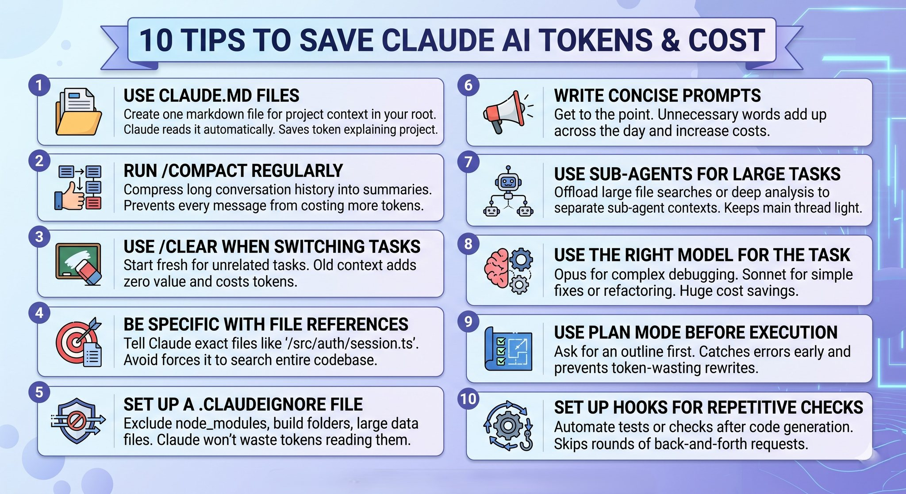

# 10 Tips to Save Claude AI Tokens & Cost

## Overview

When working with LLMs in IDE extensions like Claude Code or Cursor, token management is critical for both cost control and performance. These 10 tips help you minimize token usage while maximizing productivity.

---

## 1. Use CLAUDE.md Files

**Tip:** Create one markdown file for project context in your root. Claude reads it automatically. Saves tokens explaining project.

**Why it works:** Instead of repeatedly pasting project rules, tech stacks, or architectural decisions into every new chat—which multiplies your input token count significantly—a centralized context file allows the AI to reference the high-level roadmap efficiently without manual, repetitive input.

---

## 2. Run `/compact` Regularly

**Tip:** Compress long conversation history into summaries. Prevents every message from costing more tokens.

**Why it works:** LLMs use chat history to maintain context. In long sessions, every new prompt appends the *entire* past conversation, creating an exponential growth in input tokens. Compacting summarizes the past history, drastically cutting down the "baggage" carried into the next prompt.

---

## 3. Use `/clear` When Switching Tasks

**Tip:** Start fresh for unrelated tasks. Old context adds zero value and costs tokens.

**Why it works:** If you move from fixing a database bug to styling a CSS button, carrying over the database logs and code snippets serves no purpose. Wiping the slate clean stops you from paying for irrelevant context.

---

## 4. Be Specific with File References

**Tip:** Tell Claude exact files like `/src/auth/session.ts`. Avoid forces it to search entire codebase.

**Why it works:** When you are vague (e.g., "Fix the login bug"), the AI tool may have to scan, index, or ingest multiple files to find the relevant code. Explicitly pointing to a specific file path keeps the input context highly targeted and narrow.

---

## 5. Set Up a `.claudeignore` File

**Tip:** Exclude node_modules, build folders, large data files. Claude won't waste tokens reading them.

**Why it works:** Just like `.gitignore`, this prevents the AI from accidentally reading massive, auto-generated, or third-party folders. Ingesting a folder like `node_modules` can instantly max out your token limit and spike your API costs on a single query.

---

## 6. Write Concise Prompts

**Tip:** Get to the point. Unnecessary words add up across the day and increase costs.

**Why it works:** Every word of fluff or conversational pleasantry translates to input tokens. Being direct, structured, and clear saves money, especially when compounded over hundreds of prompts a day.

---

## 7. Use Sub-Agents for Large Tasks

**Tip:** Offload large file searches or deep analysis to separate sub-agent contexts. Keeps main thread light.

**Why it works:** If a complex task requires massive data ingestion, letting a temporary "sub-agent" do the heavy lifting means that massive chunk of data stays within that sub-thread. It doesn't pollute your main conversation thread, keeping your primary interactions fast and cheap.

---

## 8. Use the Right Model for the Task

**Tip:** Opus for complex debugging. Sonnet for simple fixes or refactoring. Huge cost savings.

**Why it works:** Frontier models (like Claude Opus) are significantly more expensive per token than faster, more efficient models (like Claude Sonnet or Haiku). Using the heavyweight model for minor tasks like syntax fixes or basic HTML edits is an expensive overkill.

---

## 9. Use Plan Mode Before Execution

**Tip:** Ask for an outline first. Catches errors early and prevents token-wasting rewrites.

**Why it works:** Generating hundreds of lines of code only to realize the AI misunderstood the assignment wastes massive amounts of output tokens. Asking for a blueprint first takes very few tokens and ensures you are both aligned before generating the bulk of the code.

---

## 10. Set Up Hooks for Repetitive Checks

**Tip:** Automate tests or checks after code generation. Skips rounds of back-and-forth requests.

**Why it works:** Instead of asking Claude to "check if this code works," running localized, automated unit tests or linters gives you immediate feedback. You only use the AI to *fix* identified errors, skipping the expensive "blind review" chats.

---

## Key Takeaways

| Tip | Token Savings | Complexity |
|-----|---------------|------------|
| CLAUDE.md Files | High | Low |
| `/compact` | High | Low |
| `/clear` | Medium | Low |
| Specific File References | Medium | Low |
| `.claudeignore` | Very High | Low |
| Concise Prompts | Medium | Low |
| Sub-Agents | High | Medium |
| Right Model | Very High | Low |
| Plan Mode | High | Low |
| Hooks | High | Medium |

## Related Concepts

- [[prompt-engineering]] — Crafting effective prompts
- [[context-compression]] — Managing context window size
- [[claude-code]] — IDE integration best practices
