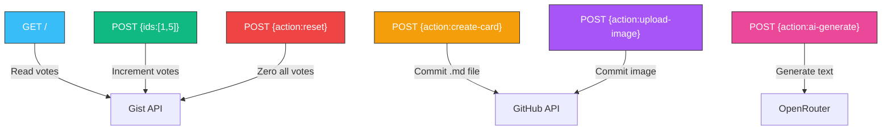

# Deployment Documentation

All deployment guides for the Claude Certification Study App infrastructure.

## Guides

| Document | Description |
|----------|-------------|
| [Cloudflare Worker](cloudflare-worker.md) | Deploy and maintain the vote/content worker |

## Quick Links

| Resource | URL |
|----------|-----|
| Cloudflare Dashboard | https://dash.cloudflare.com/3683d1886e0a3a3152242c84f226ba3f/workers-and-pages |
| Worker Endpoint | https://tiny-mode-1370.polished-boat-17b2.workers.dev |
| GitHub Gist (votes) | https://gist.github.com/rifaterdemsahin/2bfb092b05e08669b092f8371ac9c018 |
| GitHub Repo | https://github.com/rifaterdemsahin/claude_certification_exam |
| GitHub Pages | https://rifaterdemsahin.github.io/claude_certification_exam |
| OpenRouter Keys | https://openrouter.ai/keys |
| GitHub Tokens | https://github.com/settings/tokens |

## Worker Actions Summary

## Prerequisites

- GitHub Classic Token with `repo` + `gist` scopes
- OpenRouter API Key (for AI writing helper)
- Cloudflare free tier account
