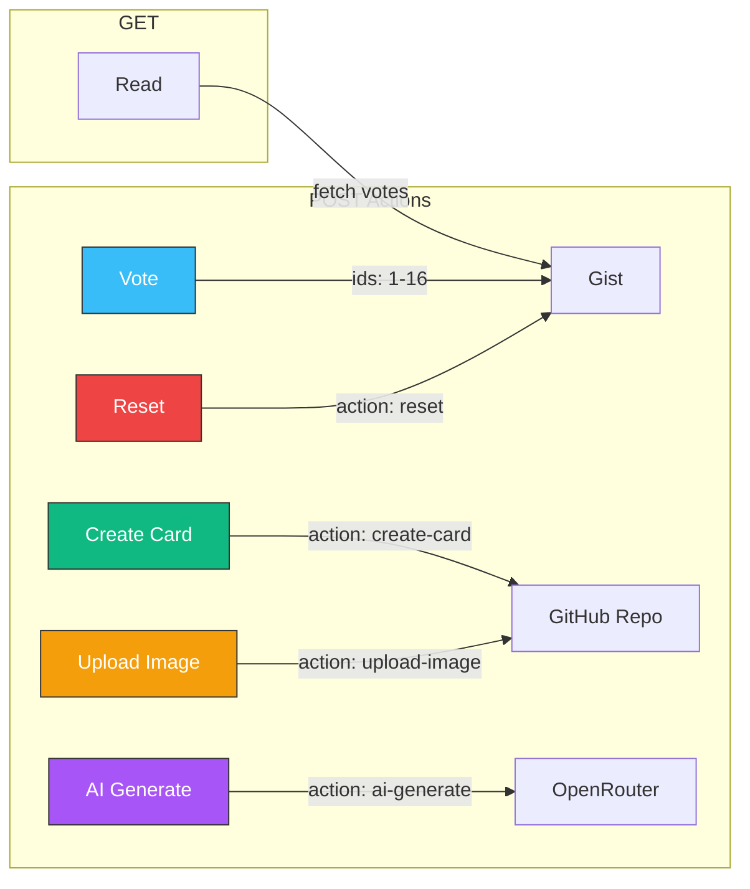

# Cloudflare Worker Deployment Guide

Complete guide for deploying the Claude Certification vote worker to Cloudflare.

## Dashboard URL

**https://dash.cloudflare.com/3683d1886e0a3a3152242c84f226ba3f/workers-and-pages**

## Architecture

```mermaid
flowchart TD
    A[Browser] -->|GET /| B[Cloudflare Worker]
    A -->|POST / vote| B
    A -->|POST / create-card| B
    A -->|POST / upload-image| B
    A -->|POST / ai-generate| B

    B -->|Read votes| C[GitHub Gist]
    B -->|Write votes| C
    B -->|Commit files| D[GitHub Repo]
    B -->|Upload images| D
    B -->|Generate text| E[OpenRouter API]

    C -->|Store| F[(claude-cert-votes.json)]
    D -->|Store| G[(formula/memory/*.md)]
    D -->|Store| H[(assets/memory/*.{svg,png})]

    style A fill:#38bdf8,stroke:#333,color:#fff
    style B fill:#a855f7,stroke:#333,color:#fff
    style C fill:#10b981,stroke:#333,color:#fff
    style D fill:#10b981,stroke:#333,color:#fff
    style E fill:#f59e0b,stroke:#333,color:#fff
```

## Prerequisites

| Item | Where to get it |
|------|-----------------|
| GitHub Classic Token | github.com/settings/tokens → check `repo` + `gist` |
| OpenRouter API Key | openrouter.ai/keys |
| Cloudflare Account | dash.cloudflare.com (free tier works) |

## Worker Actions



## Step-by-Step Deployment

### Step 1: Get Your Tokens

#### GitHub Classic Token
1. Go to **github.com/settings/tokens**
2. Click **Generate new token** → **Classic**
3. Name: `claude-cert-worker`
4. Expiration: 90 days
5. Check these scopes:
   - `repo` (full control of repositories)
   - `gist` (full control of gists)
6. Click **Generate token**
7. **Copy immediately** — you won't see it again

#### OpenRouter API Key
1. Go to **openrouter.ai/keys**
2. Click **Create Key**
3. Name: `claude-cert-worker`
4. **Copy the key**

### Step 2: Open Cloudflare Dashboard

1. Go to: **https://dash.cloudflare.com/3683d1886e0a3a3152242c84f226ba3f/workers-and-pages**
2. Find **tiny-mode-1370** in the workers list
3. Click on it to open the worker

### Step 3: Edit the Worker Code

1. Click **Edit Code** (top right button)
2. The code editor opens with the current worker code
3. **Select all** the existing code (Cmd+A / Ctrl+A)
4. **Delete** it
5. Open `scripts/vote-worker.js` from the project:
   ```bash
   open scripts/vote-worker.js
   ```
6. **Copy the entire file** content
7. **Paste** into the Cloudflare code editor

### Step 4: Replace Placeholder Tokens

In the Cloudflare editor, find and replace these two lines:

```javascript
// FIND these lines:
const GITHUB_TOKEN = 'PASTE_YOUR_TOKEN_HERE';
const OPENROUTER_KEY = 'PASTE_OPENROUTER_KEY_HERE';

// REPLACE with your actual tokens:
const GITHUB_TOKEN = 'github_pat_XXXX...';  // Your GitHub token
const OPENROUTER_KEY = 'sk-or-XXXX...';      // Your OpenRouter key
```

**Important:** Do NOT share these tokens. They are only stored in the Cloudflare Worker (server-side).

### Step 5: Deploy

1. Click **Save and Deploy** (top right)
2. Wait for deployment confirmation
3. The worker is now live at: `https://tiny-mode-1370.polished-boat-17b2.workers.dev`

### Step 6: Verify Deployment

Run the test suite from the project root:

```bash
node tests/test_vote_worker.js
```

Expected output — all 19 tests should pass:

```
=== Vote Worker Tests ===

[GET endpoint]
  PASS: GET returns vote JSON
  PASS: GET has all 16 vote keys

[POST vote endpoint]
  PASS: POST valid single vote
  PASS: POST valid multi vote (3 ids)
  PASS: POST rejects empty ids array
  PASS: POST rejects ids > 16
  PASS: POST rejects ids < 1
  PASS: POST rejects 4 ids
  PASS: POST rejects missing ids
  PASS: POST accepts single number (not array)

[CORS]
  PASS: OPTIONS returns CORS headers

[Reset]
  PASS: POST reset action works

[Create Card]
  PASS: POST create-card rejects invalid path
  PASS: POST create-card rejects missing content

[Upload Image]
  PASS: POST upload-image rejects non-image path

[AI Generate]
  PASS: POST ai-generate rejects empty prompt

[Methods]
  PASS: PUT returns 405
  PASS: DELETE returns 405

=== Tests Complete ===
```

### Step 7: Test Each Feature

#### Test Vote
```bash
curl -X POST https://tiny-mode-1370.polished-boat-17b2.workers.dev/ \
  -H "Content-Type: application/json" \
  -d '{"ids": [1]}'
```
Expected: `{"ok":true,"votes":{"1":1,...}}`

#### Test Create Card
```bash
curl -X POST https://tiny-mode-1370.polished-boat-17b2.workers.dev/ \
  -H "Content-Type: application/json" \
  -d '{"action":"create-card","path":"formula/memory/MEM-Q999.md","content":"# Test\nHello","message":"Test"}'
```
Expected: `{"ok":true,"sha":"...","name":"MEM-Q999.md"}`

#### Test AI Generate
```bash
curl -X POST https://tiny-mode-1370.polished-boat-17b2.workers.dev/ \
  -H "Content-Type: application/json" \
  -d '{"action":"ai-generate","prompt":"What is an agentic loop?"}'
```
Expected: `{"text":"An agentic loop is..."}`

#### Test Reset
```bash
curl -X POST https://tiny-mode-1370.polished-boat-17b2.workers.dev/ \
  -H "Content-Type: application/json" \
  -d '{"action":"reset"}'
```
Expected: `{"ok":true,"votes":{"1":0,...}}`

## Troubleshooting

| Error | Cause | Fix |
|-------|-------|-----|
| `Invalid vote` | Missing or malformed `ids` field | Send `{ "ids": [1, 5] }` |
| `Missing ids field` | POST body has no `ids` key | Add `ids` array to request |
| `Resource not accessible` | Fine-grained token | Use classic token with `repo` + `gist` |
| `GitHub PATCH failed` | Token expired or wrong scopes | Regenerate token with correct scopes |
| `OpenRouter key not configured` | Placeholder not replaced | Paste real key in worker code |
| CORS error | Origin not allowed | Check `ALLOWED_ORIGIN` in worker code |

## Token Rotation

Tokens expire. When they do:

1. Generate new token at github.com/settings/tokens
2. Go to Cloudflare dashboard → tiny-mode-1370 → Edit Code
3. Replace `GITHUB_TOKEN` value
4. Save and Deploy
5. Run tests to verify

## Related Documentation

- [Vote Worker Setup](../../docs/vote-worker-setup.md) — Original setup guide
- [GitHub Token Permissions](../../docs/github-token-permissions.md) — Token scopes explained
- [Vote Worker Tests](../../tests/test_vote_worker.js) — Test suite
