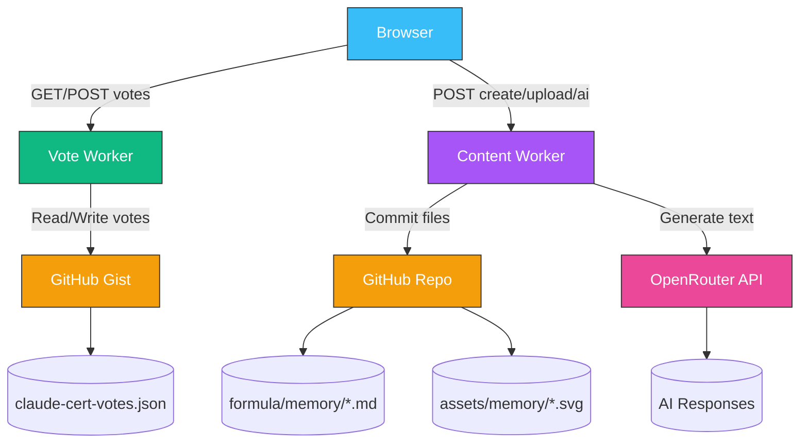

# Cloudflare Worker Deployment Guide

Two workers power the Claude Certification Study App: one for voting, one for content.

## Dashboard URL

**https://dash.cloudflare.com/3683d1886e0a3a3152242c84f226ba3f/workers-and-pages**

## Architecture



## Worker Overview

| Worker | File | Purpose | Token Scope |
|--------|------|---------|-------------|
| Vote Worker | `scripts/vote-worker.js` | Vote read/write/reset | `gist` |
| Content Worker | `scripts/content-worker.js` | Cards, images, AI | `repo` |

## Prerequisites

| Item | Where to get it |
|------|-----------------|
| GitHub Classic Token | github.com/settings/tokens → check `repo` + `gist` |
| OpenRouter API Key | openrouter.ai/keys |
| Cloudflare Account | dash.cloudflare.com (free tier) |

## Step-by-Step Deployment

### Step 1: Get Your Tokens

#### GitHub Classic Token
1. Go to **github.com/settings/tokens**
2. Click **Generate new token** → **Classic**
3. Name: `claude-cert-worker`
4. Expiration: 90 days
5. Check: `repo` + `gist`
6. Click **Generate token** → **Copy immediately**

#### OpenRouter API Key
1. Go to **openrouter.ai/keys**
2. Click **Create Key** → **Copy**

### Step 2: Deploy Vote Worker

1. Go to: **https://dash.cloudflare.com/3683d1886e0a3a3152242c84f226ba3f/workers-and-pages**
2. Find **tiny-mode-1370** (existing vote worker)
3. Click **Edit Code**
4. Open `scripts/vote-worker.js` from the project
5. Replace `PASTE_YOUR_TOKEN_HERE` with your GitHub token
6. Select all → paste into Cloudflare editor → **Save and Deploy**
7. Test: `curl https://tiny-mode-1370.polished-boat-17b2.workers.dev/`

### Step 3: Deploy Content Worker

1. Go to: **https://dash.cloudflare.com/3683d1886e0a3a3152242c84f226ba3f/workers-and-pages**
2. Click **Create** → **Hello World** → **Deploy**
3. Name it: `claude-cert-content`
4. Click **Edit Code**
5. Open `scripts/content-worker.js` from the project
6. Replace placeholders:
   - `PASTE_YOUR_TOKEN_HERE` → GitHub token
   - `PASTE_OPENROUTER_KEY_HERE` → OpenRouter key
7. Select all → paste into Cloudflare editor → **Save and Deploy**
8. Copy the new worker URL (e.g., `https://claude-cert-content.xxx.workers.dev`)

### Step 4: Update Client Code

Update the content worker URL in these files:

```bash
# Find and replace in these files:
# - pages/add_memory_card.html
# - tests/test_content_worker.js
```

Replace `PASTE_CONTENT_WORKER_URL_HERE` with the actual content worker URL.

### Step 5: Verify

```bash
# Test vote worker
node tests/test_vote_worker.js

# Test content worker (after updating URL in test file)
node tests/test_content_worker.js
```

## Worker Endpoints

### Vote Worker

| Action | Body | Description |
|--------|------|-------------|
| GET | — | Read all votes |
| POST | `{ "ids": [1, 5] }` | Cast vote (1-3 ids, each 1-16) |
| POST | `{ "action": "reset" }` | Reset all votes to 0 |

### Content Worker

| Action | Body | Description |
|--------|------|-------------|
| GET | — | Health check |
| POST | `{ "action": "create-card", "path": "...", "content": "..." }` | Commit memory card |
| POST | `{ "action": "upload-image", "path": "...", "content": "base64" }` | Upload image |
| POST | `{ "action": "ai-generate", "prompt": "...", "system": "..." }` | Generate text via AI |

## Troubleshooting

| Error | Cause | Fix |
|-------|-------|-----|
| `Invalid vote` | Missing/malformed `ids` | Send `{ "ids": [1, 5] }` |
| `Missing ids field` | No `ids` in body | Add `ids` array |
| `Resource not accessible` | Fine-grained token | Use classic token |
| `OpenRouter key not configured` | Placeholder not replaced | Paste real key |
| CORS error | Origin mismatch | Check `ALLOWED_ORIGIN` |
| `Unknown action` | Typo in action name | Check action spelling |

## Token Rotation

1. Generate new token at github.com/settings/tokens
2. For each worker: Cloudflare → Edit Code → Replace token → Save and Deploy
3. Run tests to verify
